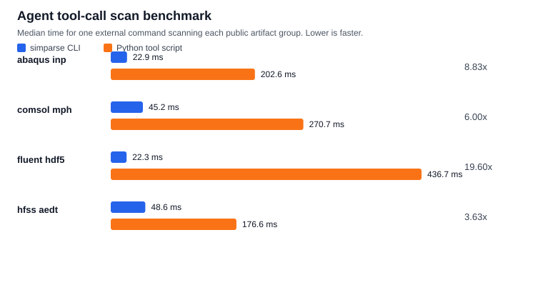

# simparse

`simparse` is a lightweight Rust and Python scanner for simulation project and
case metadata.

## Supported formats

| Format | Files |
|---|---|
| COMSOL | `.mph` |
| Abaqus | `.inp`, `.inc` |
| Fluent | `.cas.h5`, `.msh.h5` |
| HFSS / AEDT | `.aedt`, `.aedtz` |

## CLI

```powershell
cargo run -p simparse-cli -- inspect /path/to/model.mph --json
cargo run -p simparse-cli -- scan /path/to/history --jsonl
```

## Python

```powershell
maturin develop
python -c "import simparse; print(simparse.inspect('/path/to/model.inp'))"
```

## Benchmark



```powershell
python benchmarks/compare.py
```

This benchmark models one practical agent path: call one external tool to scan a
group of public simulation artifacts. The bars include process startup and
library import cost. The JSON artifact also records an in-process Python
baseline for context; those numbers are useful for library-level comparison, but
are not the primary agent tool-call scenario.

The benchmark downloads public URLs listed in `benchmarks/public-artifacts.json`
into `target/` and writes `artifacts/public-benchmark.json` plus
`artifacts/public-benchmark.svg`. Vendor-native parser timings are not included
because they require locally licensed software or APIs.

## License

Apache-2.0
